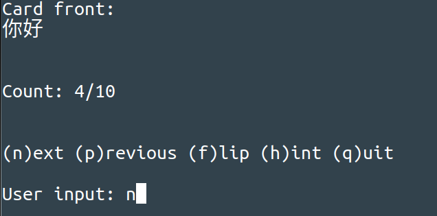

 

# Minimal Terminal Flashcard App

## How it works
### Manage your flashcards with a csv file
- The app takes a csv file as input.

The csv file should be of the form:

	Note: The headers "front", "back", and "hint" must exist
|front|back|hint|
|-----|----|----|
|f    |b   |h   |
|你好  |ni3hao3|hello|

### Interface

	Usage of ./flash-cards:
 	-f string
		file: path to csv file
  	-s 	Shuffle the cards (default true)
